# DropStream

DropStream is an unofficial fork of [Twitch Drops Miner (TDM)](https://github.com/DevilXD/TwitchDropsMiner),
created by DevilXD. It's built and maintained by [SanoBld](https://github.com/SanoBld). The drop-mining
engine and most of the original design still come straight from DevilXD's project, and full credit goes to them for
that part. On top of it, this fork adds a dashboard, multi-account profiles, a scheduler, a remote web
dashboard, and a reworked theme system, described below. If DropStream is useful to you, consider
[supporting DevilXD](https://www.buymeacoffee.com/DevilXD) too, since the mining engine underneath is
their work.

The app lets you AFK-mine timed Twitch drops without babysitting it: no switching channels by hand when
the one you're watching goes offline, no clicking to claim drops, and no actual stream data being
downloaded, which saves you bandwidth.

## How It Works

Every few seconds, the app requests a stream's metadata instead of actually watching it, which is enough
for Twitch to count progress toward a drop. No video or audio is ever downloaded. A persistent, sharded
websocket connection also keeps every channel's status (online/offline) and live viewer count up to date.

## What DropStream adds on top of the original TDM

### Dashboard

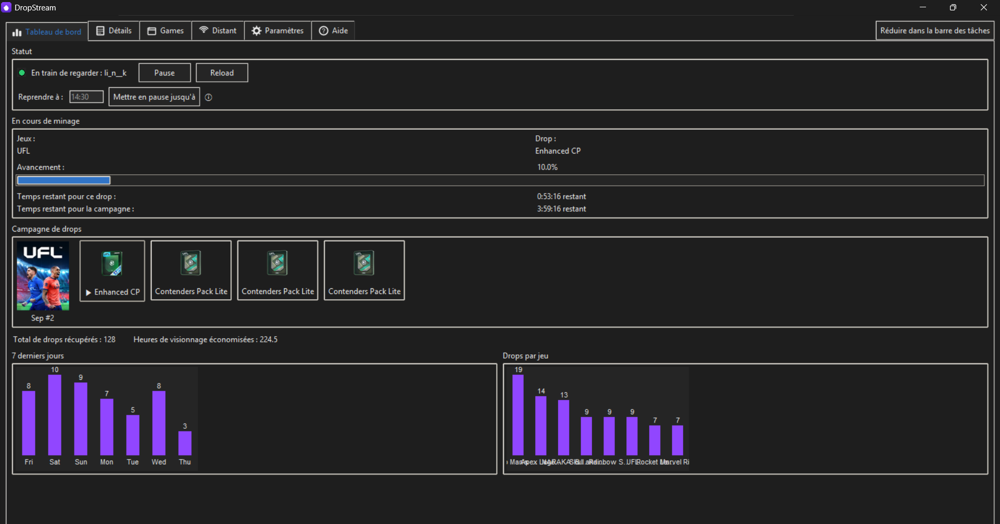

An overview tab: the current pause/resume state, the drop and campaign being mined right now with its
progress bar and time remaining, the full campaign artwork with every reward item, a chart of mining
activity over the last 7 days, a breakdown of drops per game, and running totals for drops claimed and
watch hours saved.

### Games (priority & exclude lists)

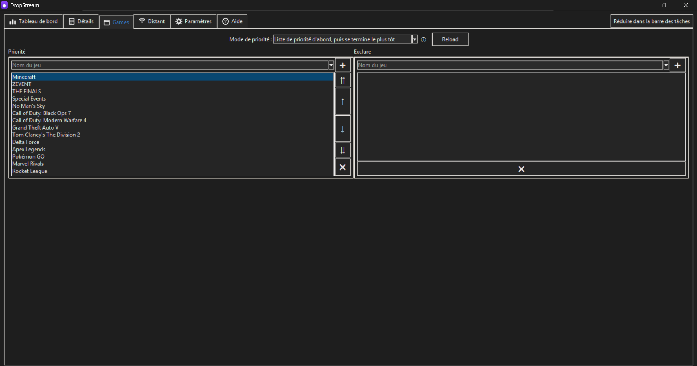

A clearer, dedicated tab for the game **Priority** and **Exclude** lists that used to live buried in
Settings. Reorder priorities with one click (move up/down, top/bottom), pick a priority mode from the
dropdown, and press **Reload** to apply changes.

### Details

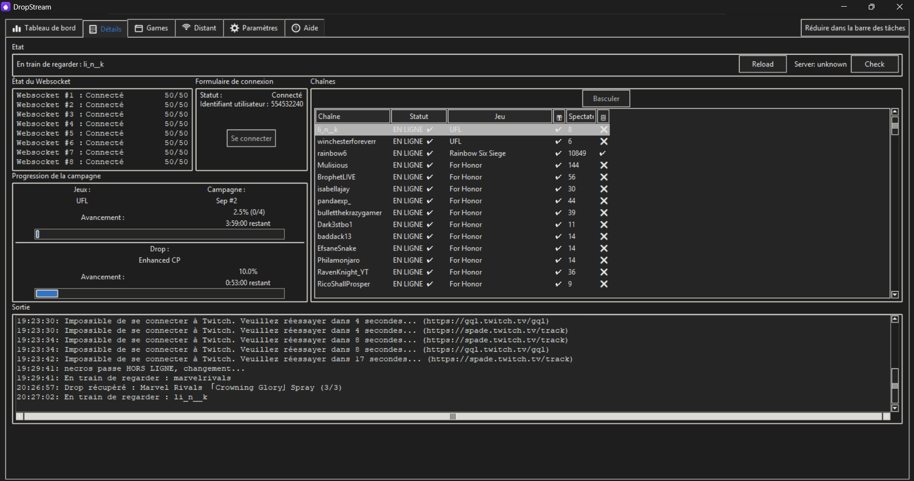

Everything about what's currently going on, in one place: the currently-watched channel, per-shard
websocket connection status, the login/connection form, the full list of matching channels with their
live status/game/viewer count, current campaign and drop progress, and the raw application log/output.

### Remote web dashboard

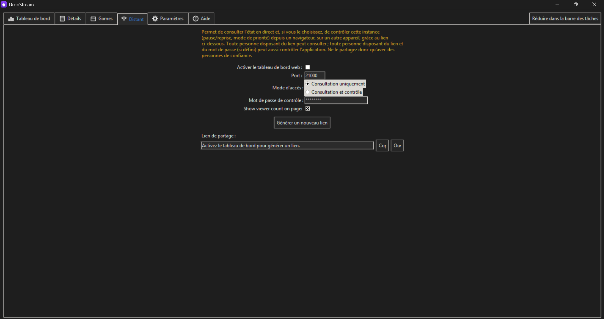

Its own **Distant/Remote** tab: turn on a small built-in web server and generate a private link (a random
token embedded in the URL, e.g. `http://192.168.1.42:21000/8f3a.../`), with an "Open" button to launch it
directly in your default browser. Anyone on the same network with that link gets a page mirroring most of
the desktop app, including the current drop and campaign with reward art pulled straight from Twitch, a
small preview of the campaign's other drops, a drops-per-game leaderboard, the full campaign list (click a
drop's thumbnail for its details), a read-only Logs tab if you turn it on, and a Help tab.

You choose the **access mode**: **view only** by default, or **view and control**, which lets visitors also
pause/resume mining and change the priority mode. In control mode you can set an optional password: with
none set, anyone with the link can control the app; with one set, they also need the password (viewing
never requires it).

#### Remote dashboard tabs

**Dashboard**: the drop and campaign being mined right now, with progress bars, time remaining, the
watched channel, running totals and a drops-per-game leaderboard.

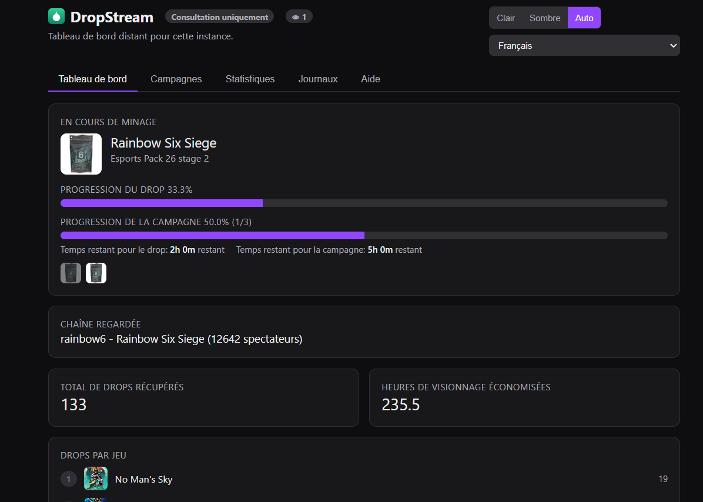

**Campaigns**: every campaign with its reward items and progress, searchable, sortable and filterable by
account.

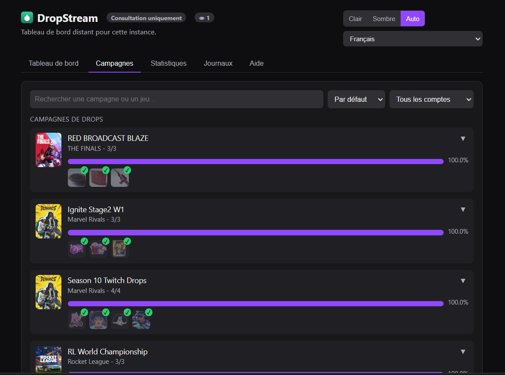

**Statistics**: drops claimed and watch hours saved, over today, 7 days, 30 days, 3 months or since the
beginning.

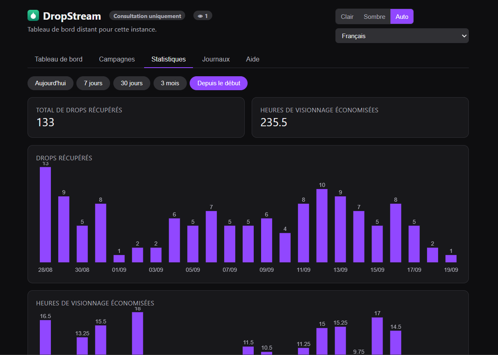

**Logs** (optional): the same lines as the desktop app's Output box, read-only.

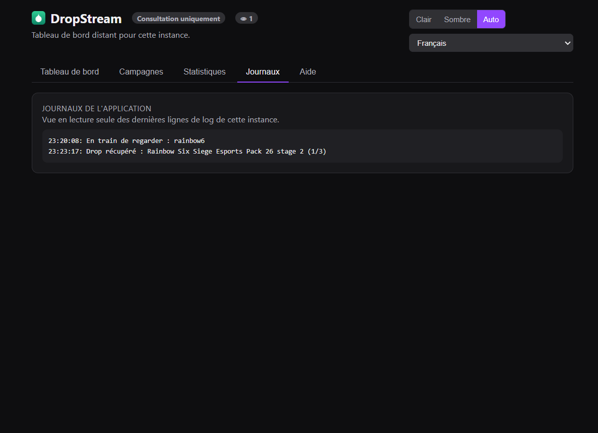

**Help**: fork info and version, how it works, and a questions and answers section.

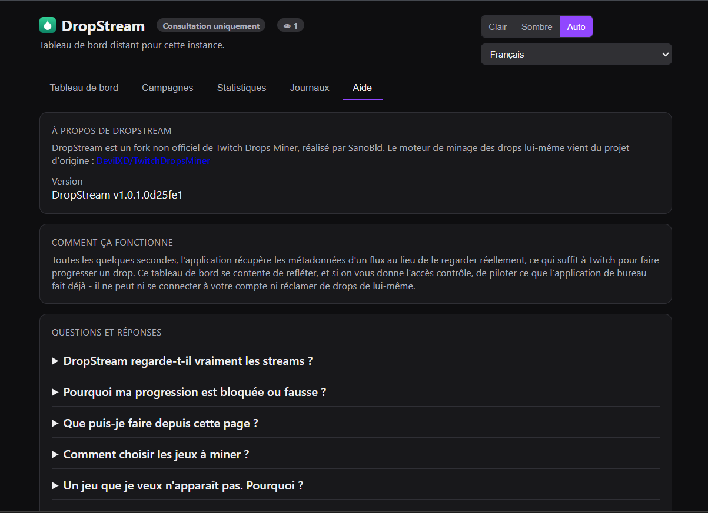

A few things worth knowing: the link itself is the only thing standing between a stranger and "just
viewing" your instance, so treat it like a password, and use "Generate a new link" whenever you want to
revoke one you shared before. By default it's only reachable on your own network; reaching it from
outside needs port forwarding on your router (which exposes the link publicly, scanners included) or a
private tunnel/VPN like Tailscale or WireGuard. The port (`21000` by default) can be changed if it clashes
with something else on your machine. It shares the same event loop as the mining logic but stays
lightweight: requests are rate-limited per visitor, box-art images are never proxied or cached by the app
itself (the page links straight to Twitch's CDN), and it can never log into your Twitch account or claim
drops on its own, it only reflects and steers what the desktop app is already doing.

### Settings

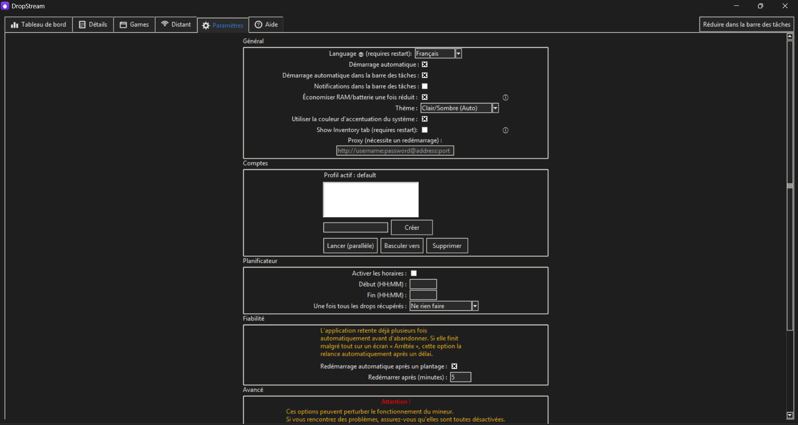

**General** covers language, autostart (with "start minimized to tray"), tray notifications, a
RAM/battery-saving mode once minimized, a Light/Dark/Auto theme (with an option to follow your OS accent
color), an optional inventory tab, and a proxy field. **Accounts** adds multi-account profiles, each with isolated
settings, cookies and cache per account, with buttons to create a profile, launch several accounts in
parallel, switch the active one, or delete it. **Scheduler** restricts mining to a daily time window, with
a configurable action once all of today's drops are claimed. **Reliability** can restart the app
automatically after a crash, after a delay you choose. **Advanced** holds lower-level tuning options for
troubleshooting; best left alone unless you know what you're doing, since they can affect stability.

### Help

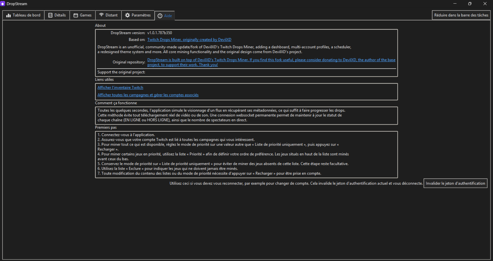

An in-app **Aide/Help** tab: version and fork info with a direct credit and link back to DevilXD's original
project, quick links to your Twitch inventory and campaigns page, a "How It Works" explanation, a
step-by-step "Getting Started" guide, and a button to invalidate your saved authentication token (useful
when switching accounts).

### Other additions

- Automatic OAuth token re-validation, to catch and recover from an expired session before it breaks
  mining.
- A resizable, scrollable main window: every tab now scrolls (mouse wheel, or the scrollbar that appears
  only when needed) instead of clipping content when the window is small. Ctrl+PageUp/PageDown switches
  tabs from anywhere.

## Features (inherited from the original engine)

- Stream-less drop mining, so no video or audio is ever downloaded.
- Game priority and exclusion lists, to focus on what you want, in the order you want, and ignore the rest.
- Sharded websocket connections, tracking up to `199` channels at the same time.
- Automatic drop-campaign discovery based on your linked accounts (you still need to
  [link accounts](https://www.twitch.tv/drops/campaigns) yourself).
- Stream tag and drop-campaign validation, so you don't end up watching a stream that can't earn the drop.
- Automatic channel switching, when the current channel goes offline or a higher-priority game's stream
  comes online.
- Login session saved to a cookies file, so you don't need to log in every run.
- Mining starts automatically as new campaigns appear and stops once all available drops are mined.

## Usage

1. Download and unzip [the latest release](../../releases). It's recommended to keep it in the folder it
   comes in.
2. Run it and log in / connect the miner to your Twitch account using the in-app login form.
3. After logging in, the app fetches every campaign and game you can mine drops for. Add the games you
   care about to the **Priority** list (Games tab), then press **Reload** to start processing.
4. If you'd rather have the miner grab anything it can beyond your Priority list, set **Priority mode** to
   anything other than "Priority list only".
5. Make sure your Twitch account is linked to the relevant games on the
   [campaigns page](https://www.twitch.tv/drops/campaigns), to unlock more of them for mining.

## Small window / compact layout

The main window can be resized noticeably smaller than before. Instead of clipping a tab's content once it
no longer fits, every tab now scrolls vertically. A scrollbar appears automatically only when needed, and the
mouse wheel scrolls the content under the cursor. The tab bar itself also supports the mouse wheel (while
hovering the row of tab labels) and Ctrl+PageUp / Ctrl+PageDown from anywhere.

## Notes

> [!WARNING]
> Due to how Twitch handles drop progression on their end, watching a stream in the browser (or by any
> other means) on the same account actively used by the miner will usually cause the miner to misbehave,
> reporting false progress and getting stuck on the current drop. Avoid watching other streams on that
> account while it's mining.

> [!CAUTION]
> Persistent cookies are stored in `cookies.jar`, from which login information is restored on every run.
> Keep that file safe: whoever has it can access your Twitch account without knowing your password.

> [!IMPORTANT]
> Logging in successfully may trigger a "New Login" notification email from Twitch. This is expected, and you
> can verify it comes from your own IP. The detected browser will show as "Chrome", since that's what the
> miner presents itself as to Twitch's servers.

> [!NOTE]
> The remaining-time countdown always ticks down one minute at a time and then pauses, restarting once the
> application re-determines the actual remaining time from Twitch (at most 20 seconds after reaching zero).
> It's only an approximation and doesn't reflect or affect actual mining speed.

> [!NOTE]
> Running from source requires Python 3.10 or higher.

### Windows build

- The app is packaged with PyInstaller into a portable `EXE`. Some antivirus engines (including Windows
  Defender) may flag it as a trojan, because PyInstaller has historically been abused to package malicious
  code by others, so these reports can be safely ignored. If you don't trust the executable, install Python
  yourself and run from source instead.
- The executable uses `%TEMP%` for temporary runtime files; persistent data is stored next to the
  executable.
- Autostart is implemented as a registry entry under the current user's (`HKCU`) autostart key. Relocating
  the app afterwards breaks it until you toggle the option off and back on.
- A native Windows installer (built with Inno Setup) is also provided alongside the portable ZIP.
- A native **Windows on ARM** build is also published, for ARM-based Windows devices (e.g. Snapdragon
  laptops).

### Linux build

- Distributed as both an [AppImage](https://appimage.org/) and a PyInstaller portable build. If unsure,
  use the AppImage.
- Both are built for `x86_64` **and `aarch64` (ARM64)**.
- Requires `glibc>=2.35` and a working display server.
- The Linux app is noticeably larger than the Windows one due to bundling `gtk3` (and its dependencies),
  required for proper system-tray/notification support.
- As an alternative, the Windows build also runs well under [Wine](https://www.winehq.org/).

### macOS build

- Packaged with PyInstaller as a standalone `.app` bundle, distributed as a ZIP, and built **natively for
  Apple Silicon (ARM64)**.
- Since it isn't signed with a paid Apple Developer certificate, **Gatekeeper will block the first run**
  ("The application is damaged and can't be opened").
  - **Fix**: open a Terminal in the folder containing the app and run `xattr -cr DropStream.app` (or type
    `xattr -cr ` with a trailing space, then drag the `.app` into the terminal window to auto-fill the
    path, and press Enter).
- Persistent files (`cookies.jar`, `settings.json`, `lock.file`, `cache/`) live inside the bundle, under
  `DropStream.app/Contents/MacOS` (right-click the app → "Show Package Contents" to access them).

## Versioning

Versions are handled automatically by the CI and shown in the app (About/Help tabs, `--version`) and in the
Remote dashboard's Help tab.

- **Publishing** (Actions > Release > Run workflow) picks the next whole number on its own: `v1`, `v2`, `v3`...
  and builds and publishes every platform with it.
- Every release keeps its own tag, so older releases are never replaced or overwritten.
- The Release workflow has a **beta** option: the release is marked as a pre-release on GitHub, is not set as
  the latest release, and the app shows `beta` next to the version.
- **Every other push** gets `v<last release>.<commits since it>`, e.g. `v4.1`, `v4.2`, `v4.3`, until the next
  release resets the counter.
- `version.py` is only a fallback for running from source; the CI overwrites it at build time.

## Advanced usage

To run from the latest source, or build your own executable, see DevilXD's original wiki page (the build
process is unchanged by this fork):
https://github.com/DevilXD/TwitchDropsMiner/wiki/Setting-up-the-environment,-building-and-running

## Support

If you run into an issue:

- Check DevilXD's [troubleshooting page](https://github.com/DevilXD/TwitchDropsMiner/wiki/Troubleshooting)
  for common issues (still applicable, since the mining engine is unchanged).
- [Search this repository's issues](../../issues) to see if it's already been reported.
- If not, feel free to open a new one describing your problem.

If you find DropStream useful, please also consider supporting DevilXD, whose original project this is
built on:

## Credits

[@SanoBld](https://github.com/SanoBld) - Creator and maintainer of the DropStream fork.

@guihkx - For the CI script, CI maintenance, and everything related to Linux builds.
@kWAYTV - For the implementation of the dark mode theme.
@crocchetto - For the macOS port.

@Bamboozul - For the entirety of the Arabic (العربية) translation.
@Suz1e - For the entirety of the Chinese (简体中文) translation and revisions.
@wwj010, @zhangminghao1989, @Self4215 - For the Chinese (简体中文) translation corrections and revisions.
@Ricky103403 - For the entirety of the Traditional Chinese (繁體中文) translation.
@LusTerCsI - For the Traditional Chinese (繁體中文) translation corrections and revisions.
@nwvh - For the entirety of the Czech (Čeština) translation.
@Kjerne - For the entirety of the Danish (Dansk) translation.
@lmdpocus - For the entirety of the Dutch (Nederlandse) translation.
@Rensoraa - For the Dutch (Nederlandse) translation corrections and revisions.
@roobini-gamer - For the entirety of the French (Français) translation.
@Calvineries - For the French (Français) translation revisions.
@ThisIsCyreX - For the entirety of the German (Deutsch) translation.
@Nagyhoho1234 - For the entirety of the Hungarian (Magyar) translation.
@Eriza-Z - For the entirety of the Indonesian translation.
@casungo - For the entirety of the Italian (Italiano) translation.
@ShimadaNanaki - For the entirety of the Japanese (日本語) translation.
@biroman - For the entirety of the Norwegian (Norsk) translation.
@Patriot99 - For the Polish (Polski) translation and revisions (co-authored with @DevilXD).
@zarigata - For the entirety of the Portuguese (Português) translation.
@Sergo1217 - For the entirety of the Russian (Русский) translation.
@kilroy98, @flamesv - For the Russian (Русский) translation corrections and revisions.
@Shofuu - For the entirety of the Spanish (Español) translation and revisions.
@Forero-0 - For the Spanish (Español) translation revisions.
@alikdb - For the entirety of the Turkish (Türkçe) translation.
@DogancanYr, @Elderly-Emre, @Hweord - For the Turkish (Türkçe) translation corrections and revisions.
@Nollasko - For the entirety of the Ukrainian (Українська) translation and revisions.
@kilroy98 - For the Ukrainian (Українська) translation corrections and revisions.
